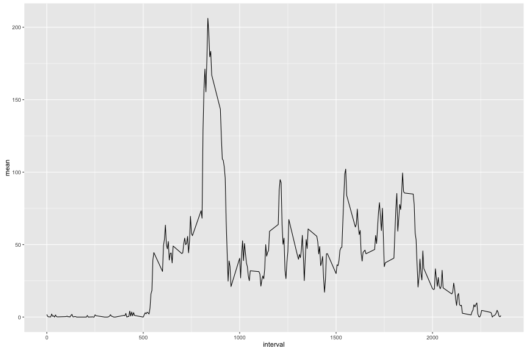

## Reading in the dataset and processing the data

```r
library(dplyr)
library(lubridate)
library(ggplot2)
library(tidyr)

activity <- read.csv("data/activity.csv") %>%
  mutate(date=ymd(date))
```

## Histogram of the total number of steps taken each day

```r
activity %>%
  filter(!is.na(steps)) %>%
  group_by(date) %>%
  summarise(total_steps=sum(steps, na.rm=T)) %>%
  ggplot(aes(x = total_steps)) +
        geom_histogram(binwidth = 1000) +
        labs(title = "Daily Steps", x = "Total Steps", y = "Frequency")
```


## Mean and median number of steps taken each day

```r
activity %>%
  group_by(date) %>%
  summarise(mean=mean(steps, na.rm=T), median=median(steps, na.rm=T))
```

```
## # A tibble: 61 x 3
##          date     mean median
##        <date>    <dbl>  <dbl>
## 1  2012-10-01      NaN     NA
## 2  2012-10-02  0.43750      0
## 3  2012-10-03 39.41667      0
## 4  2012-10-04 42.06944      0
## 5  2012-10-05 46.15972      0
## 6  2012-10-06 53.54167      0
## 7  2012-10-07 38.24653      0
## 8  2012-10-08      NaN     NA
## 9  2012-10-09 44.48264      0
## 10 2012-10-10 34.37500      0
## # ... with 51 more rows
```

## Time series plot of the average number of steps taken

```r
activity %>%
  group_by(date) %>%
  summarise(mean=mean(steps, na.rm=T), median=median(steps, na.rm=T)) %>%
  ggplot(aes(x=date, y=mean)) +
  geom_line() 
```


## The 5-minute interval that, on average, contains the maximum number of steps

```r
activity %>%
  group_by(interval) %>%
  summarise(mean=mean(steps, na.rm=T)) %>%
  ggplot(aes(x=interval, y=mean)) +
  geom_line()
```



```r
activity %>%
  group_by(interval) %>%
  summarise(mean=mean(steps, na.rm=T)) %>%
  top_n(1, wt=mean)
```

```
## # A tibble: 1 x 2
##   interval     mean
##      <int>    <dbl>
## 1      835 206.1698
```

## Strategy for imputing missing data
#### How many missing values in each column ?

```r
table(is.na(activity$steps))
```

```
## 
## FALSE  TRUE 
## 15264  2304
```

```r
table(is.na(activity$date))
```

```
## 
## FALSE 
## 17568
```

```r
table(is.na(activity$interval))
```

```
## 
## FALSE 
## 17568
```
There are missing values only in the "steps" column.

#### Imputing missing values

```r
#computing steps mean by interval
activity2 <- activity %>%
  group_by(interval) %>%
  mutate(steps=ifelse(is.na(steps), mean(steps, na.rm=T), steps)) %>%
  ungroup()
```

#### Histogram of the total number of steps taken each day after missing values are imputed

```r
#plotting the new dataset
activity2 %>%
  filter(!is.na(steps)) %>%
  group_by(date) %>%
  summarise(total_steps=sum(steps, na.rm=T)) %>%
  ungroup() %>%
  ggplot(aes(x = total_steps)) +
        geom_histogram(binwidth = 1000) +
        labs(title = "Daily Steps", x = "Total Steps", y = "Frequency")
```


## Panel plot comparing the average number of steps taken per 5-minute interval across weekdays and weekends

```r
activity2 %>%
  mutate(weektime=ifelse(weekdays(date) %in% c("Samedi", "Dimanche"), "weekend", "weekday")) %>%
  group_by(interval, weektime) %>%
  summarise(mean=mean(steps, na.rm=T)) %>%
  ungroup() %>%
  ggplot(aes(x=interval, y=mean, color=weektime)) +
  geom_line() +
  facet_grid(weektime~.)
```


